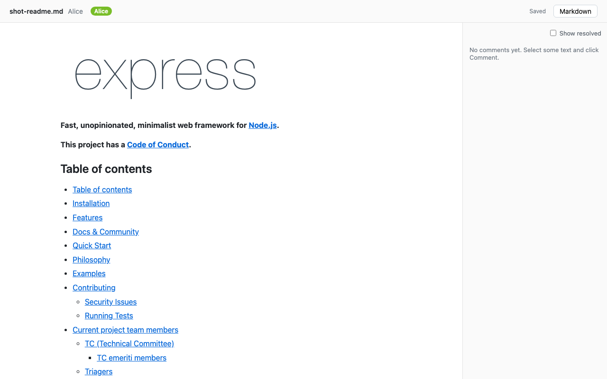
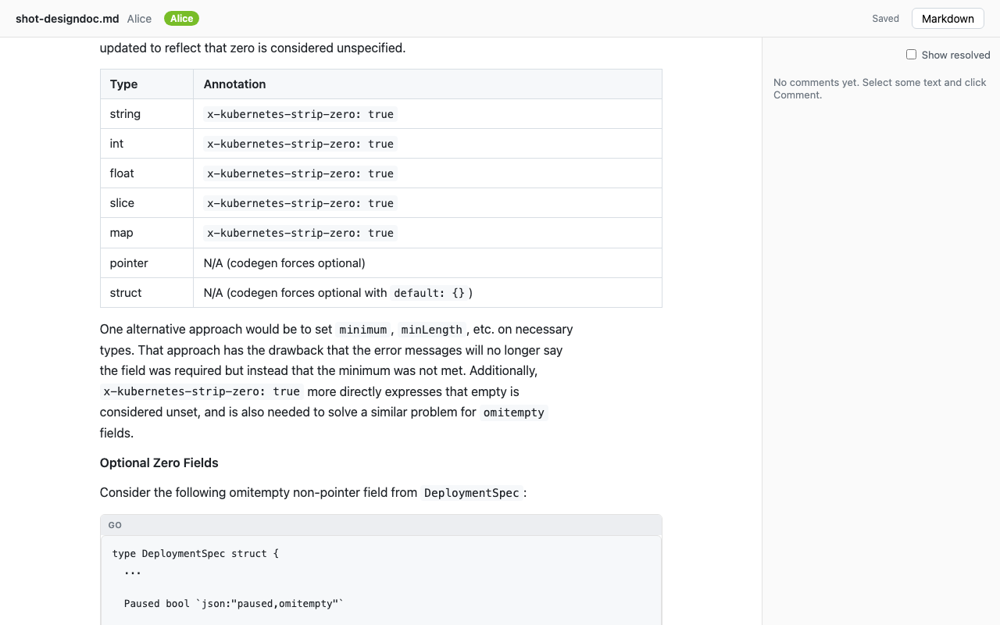
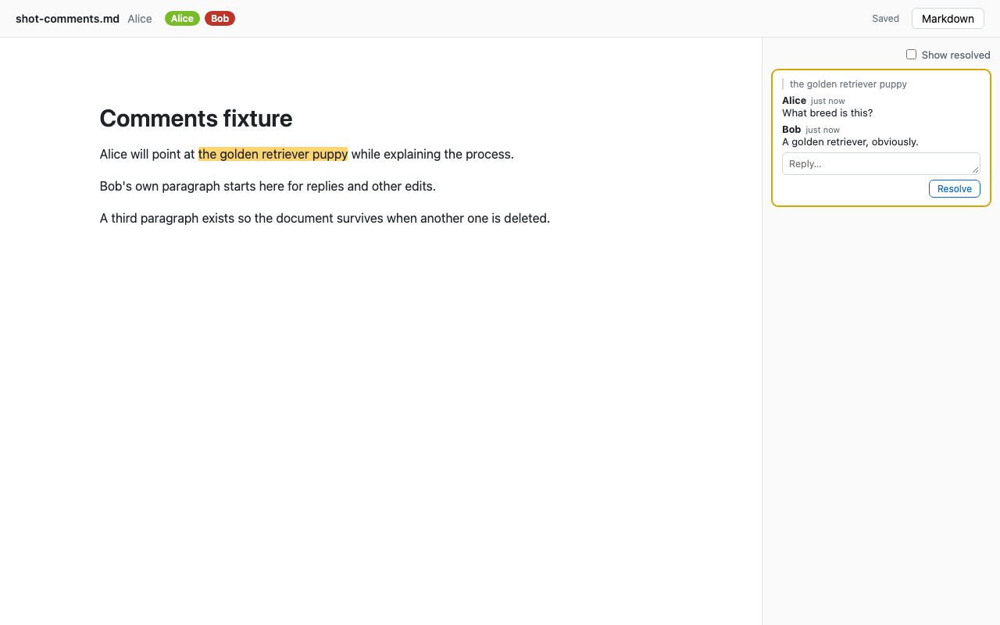
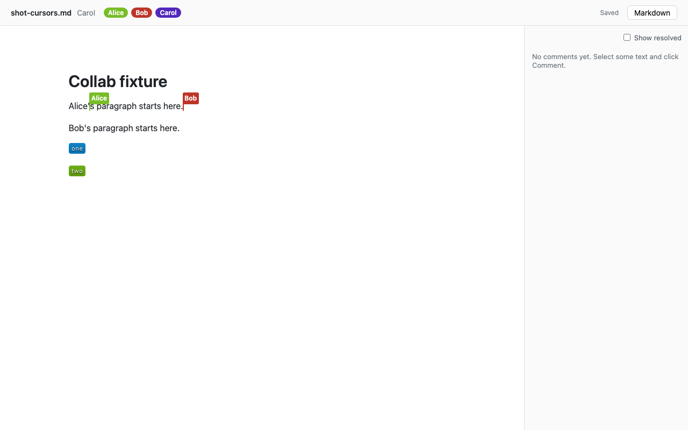
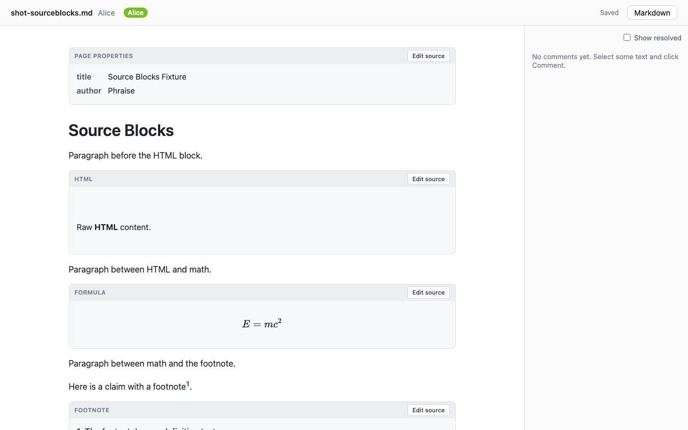
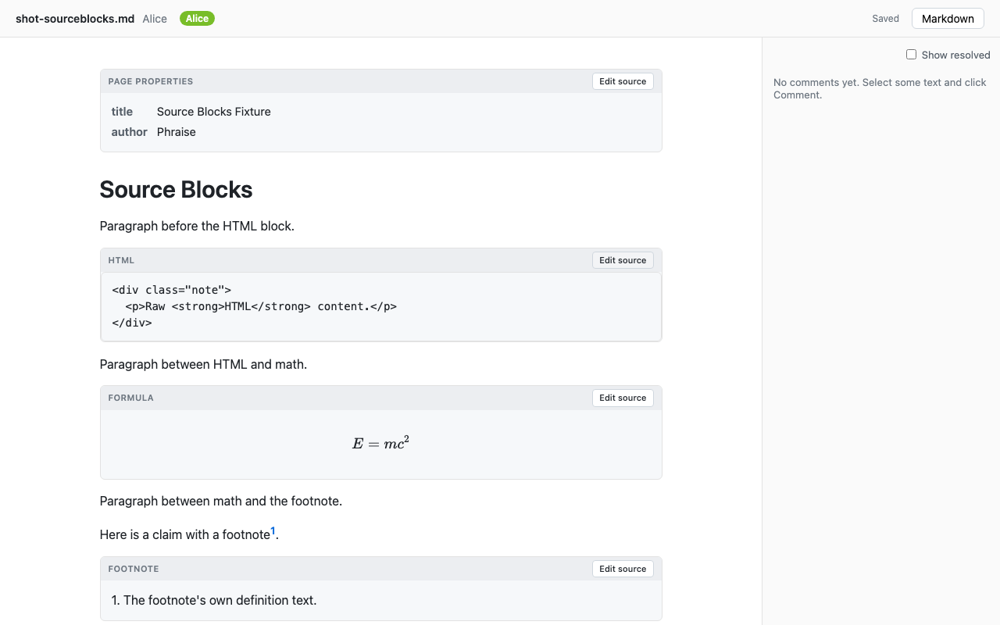
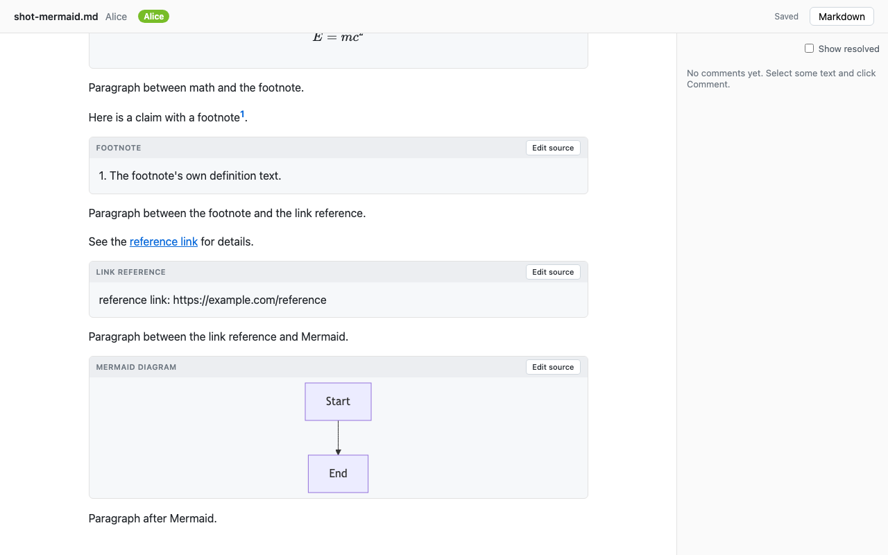
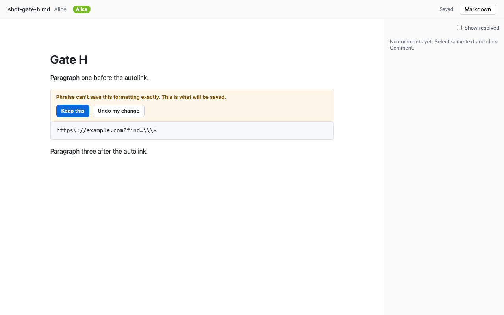
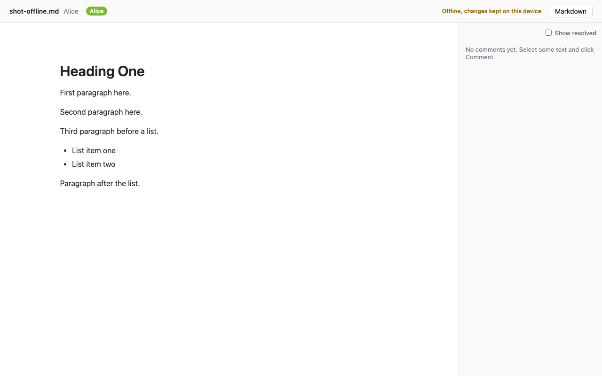
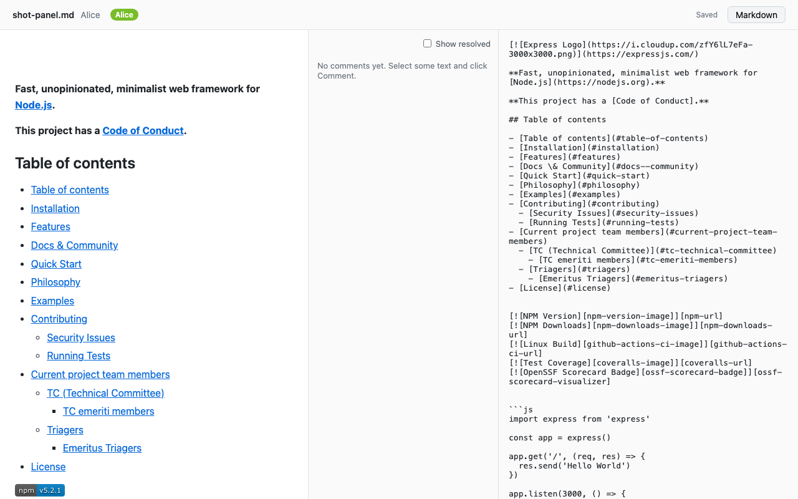

# Spike 7 findings: the web editor in a real browser

Status: final for spike 7
Author: spike 7 orchestrator (Opus 5.5)
Updated: 2026-09-28
Charter: [spike 7 charter](../plans/2026-09-27-spike-7-charter-web-editor.md). Plan and briefs: [plan](../plans/2026-09-27-spike-7-plan.md), briefs 01 to 08 in `context/plans/2026-09-27-spike-7-brief-*.md`.
Log: [orchestrator log](../logs/2026-09-27-orchestrator-spike-7.md); builder and reviewer logs are `context/logs/2026-09-27-builder-spike-7-*.md` and [reviewer](../logs/2026-09-27-reviewer-spike-7.md).
Code: [`spikes/2026-09-27-web-editor-tiptap/`](../../spikes/2026-09-27-web-editor-tiptap/README.md).
Serves: the vision's first requirement; D3, D4 and D5.

## Answer

**The editing experience the vision asks for is within reach on the chosen stack.** A Tiptap 3 editor on spike 1's schema, spike 5's Hocuspocus relay and Yjs 13 workarounds, with spike 1's parser and serializer in the page, passes all eleven gates in headless Chromium under real keyboard, mouse, clipboard and input-method events: typing and structure editing leave untouched blocks byte-identical, two people see each other's edits and named cursors, undo is per person, comments follow the text, Japanese and Chinese composition survive a second person typing in the same paragraph, and a person can go offline, reload, keep typing and converge. What is missing is product surface (a toolbar, table row and column editing, image insertion), not architecture. Two things need engineering before large documents: whole-document serialization freezes the page for about a second on a 240 KB file, and the Yjs binding needed a third workaround for a caret bug found here.

## Gate results

Command, from a clean checkout of the branch, in the spike directory: `npm ci && npm run setup && npm test && npm run gates`. Final run by the orchestrator: exit 0, 95 Playwright tests in Chromium plus 58 in WebKit, about one minute; 187 unit tests. The Chromium suite also passed `--repeat-each=3` (285 of 285). A fresh-context reviewer ran everything from a fresh clone of the pushed branch; its one blocker (gate E failing) was caused by a late change of mine to the tests' line keys and is fixed, see the log.

| Gate | Chromium | Result |
|---|---|---|
| A. Typing | PASS, 22 tests | Typing, Enter, Backspace and Delete across block boundaries, split and join (byte-identical after join), select across paragraphs and type over, Mod-B, Mod-I, Mod-E (code), Mod-K (link field, with Remove link), lists with Enter, Tab and Shift-Tab in bullet and ordered lists, table cell typing and Tab navigation. Every test asserts the full expected Markdown, so untouched blocks are byte-identical by construction. |
| B. Markdown affordances | PASS, 24 tests | `#` to `######`, `-`, `*`, `1.`, `>`, fences with and without a language, `---`, each undone by Backspace. Paste of Markdown text (headings, list, bold, link, table, fence) becomes rich content; paste of HTML goes through the schema. Real Mod-C puts Markdown in `text/plain` (`**`, `[..](..)`, `- `) and HTML in `text/html`; Mod-V pastes it back. Paste tests dispatch a real `ClipboardEvent` rather than driving the OS clipboard. |
| C. Blocks the editor does not model | PASS, 6 tests | Front matter, HTML, `$$` math, footnote definitions, link reference definitions render as labelled cards (key-value rows, sanitized HTML preview, KaTeX, "1. text", "reference link: url"); editing each source changes exactly its bytes; typing, Enter, Backspace and Delete next to each leave it byte-identical; Mermaid renders an `svg` with the source editable; `<script>` and `onerror` in an HTML block do nothing. The "unknown construct" case cannot be produced by this parser on valid input and is covered by a unit test. |
| D. Collaboration | PASS, 6 tests | Two browser contexts through the relay: edits in different and in the same paragraph converge; named, coloured carets visible both ways; the local caret stays put while the other person types before it (the bug below); a linked badge's address and link changed together through an image popover reach the other browser and a fresh third one. |
| E. Undo | PASS, 3 tests | Alternate typing in one paragraph: Alice's undo removes only her words and redo restores them; undoing her bold leaves Bob's edit; her undo neither removes Bob's inserted block nor restores his deleted one. |
| F. Comments | PASS, 6 tests | Select with Shift+Arrow, Comment button or Mod-Alt-M, thread in the sidebar, reply, resolve (highlight gone in both, thread under "Show resolved"); highlight follows Bob's typing before and inside the phrase and a new paragraph above; deleting the paragraph orphans the thread with its quote in both; Markdown byte-identical throughout; survives reload and appears for a third context. |
| G. Input methods | PASS, 6 tests | Driven through the DevTools protocol (`Input.imeSetComposition`, `Input.insertText`): Japanese `にほんご` to `日本語` while Bob types before and after the caret in the same paragraph; Chinese `zhong` to `中`; cancelled composition; composition while Bob bolds a word in the paragraph; composition in an empty paragraph and in a table cell. Nothing broke. Composition previews reach the other user before commit. |
| H. Unverifiable block | PASS, 4 tests | Unlinking an autolink `<https://example.com?find=\*>` through the link field leaves text the serializer cannot write back (CommonMark example 20). The block becomes a source card with the best-effort Markdown and the banner "Phraise can't save this formatting exactly. This is what will be saved." with Keep this and Undo my change; both work; the other browser does not also convert it. The two constructs spike 1 listed (`&#10;&#10;` entities, `***foo** bar*`) now verify. |
| I. Offline | PASS, 2 tests | `context.setOffline(true)` severs the relay socket. Alice types, reloads while offline (service worker shell, IndexedDB document), types more, closes the page and reopens it offline, goes online: Alice, Bob and a fresh third context converge on all three edits. A second test measures the window below. |
| J. Feel | PASS, 11 tests | No Markdown syntax in the rendered text of the express README and a Kubernetes design doc (3 tables, 16 code blocks), outside code and open source editors. Ten screenshots, all under 300 KB, below. |
| K. Scale | PASS, 5 tests | Numbers below. Thresholds set by the orchestrator before measuring: first load under 5 s, p95 key-to-paint under 50 ms with the Markdown panel closed. |

Cross-browser, informational: **WebKit** passes A 22 of 22, B 19 of 21 (two copy tests skipped: Playwright WebKit cannot grant clipboard permissions), C 6 of 6, D 5 of 6 in the final run. Across runs, 3 to 6 of 58 WebKit tests fail per run, different ones each time, all at caret placement off by one after a click and arrow presses; every A to D scenario passed in WebKit in at least one run. Whether that is the harness or a WebKit selection-mapping problem in the editor is not established. **Firefox** does not launch on the owner's machine (macOS sandbox refuses its helper processes, diagnosed in the brief 07 log) and is untested.

## Scale (gate K), on the 245,936-byte Node.js N-API doc, 1,619 blocks

| Measure | Result |
|---|---|
| First visit, navigation to last block shown | 1.5 to 3.0 s across runs |
| Repeat visit, from IndexedDB | 125 to 150 ms |
| Relay's Yjs state | 845 KB |
| Key press to paint, 200 characters, Bob typing 50 blocks away and in Alice's paragraph | rAF p50 6.2 ms, p95 13.7 ms, max 16.6 ms; Event Timing keydown p95 16 ms, max 24 ms (8 ms granularity) |
| Same, Markdown panel open | rAF p95 14.7 ms; Event Timing keydown max 24 ms |
| Same, 10 KB README, one user | rAF p95 15.8 ms |
| Full `serializeDoc` in the browser | 900 to 970 ms (10 KB README: about 20 ms) |
| `parseMarkdown`, in Node | 1.3 s |
| Gate H check after one edit | first edit about 980 ms (cold, all blocks), later edits 18 ms |
| Re-anchoring 20 comments | 0.7 ms |

The gate K typing never pauses, so the 250 ms debounced work never runs during it. Measured separately with a long-task observer while typing with pauses: the first edit in the file causes one 972 ms freeze (the cold gate H check), later edits none; with the Markdown panel open, every pause causes a 930 ms freeze. **Is it fast enough in the page?** The per-keystroke path is: typing costs one frame even with a second person typing. Whole-document serialization is not: at 240 KB it blocks the page for about a second. It belongs in a Web Worker, or on an incremental per-block path like gate H's cache, and the cold check should be warmed when the browser is idle after load. For README-sized files (10 KB) everything is under 60 ms.

## Screenshots

Headless Chromium, 1280 by 800. Regenerated by `npm run gates`.

The express README, as a non-technical reader sees it:

A Kubernetes design doc with a table and code:

A comment thread with a reply:

Two named cursors in one paragraph, seen by a third person:

Source blocks as previews (front matter, HTML, formula, footnote):

The HTML block with its source open:

A rendered Mermaid diagram:

The unverifiable-block banner (gate H):

Offline status:

The Markdown panel beside the document:

The orchestrator looked at every screenshot. A non-technical reader sees a clean document with no Markdown syntax. Blemishes: empty space above the HTML card's text; the Markdown-panel shot is missing the network-hosted logo; the gate H banner shows escaped Markdown (`https\://example.com?find=\\\*`) that a non-technical user will not understand.

## Tiptap extensions: used as they are, replaced, added

- **Used as they are:** `@tiptap/core`'s `Editor` and command set (`toggleMark`, `splitListItem`, `sinkListItem`, `liftListItem`, `setTextSelection`), `@tiptap/extension-collaboration` (its Yjs undo manager gives per-user undo with no extra wiring), `@tiptap/extension-collaboration-caret`. Tiptap's base CSS must be injected; without it Chromium turns typed trailing spaces into U+00A0, which reached the Markdown (found and fixed in this spike).
- **Not used:** StarterKit and every Tiptap node or mark extension, including History, Link, Image, Table, CodeBlock. They would bring their own schema.
- **Replaced by our own `Extension`s, no schema change:** input rules; list, mark, link and table keymaps (table navigation is custom because `prosemirror-tables` needs `tableRole` in the node specs); Markdown paste and copy; fresh `src` for new blocks; empty-paragraph handling; source-block keymap and boundary guard; unverifiable-block check; comment highlights (decorations, not marks); image popover.
- **Node views:** source blocks, inline source atoms (chips, KaTeX, superscript footnote numbers), code blocks with lazy Mermaid, images (reference-style URLs resolved), table cells (header cells as `th`).
- **Workarounds on the Yjs 13 binding:** spike 5's `leafMarks` and `rootAttrs`, plus a third, `localCaretFollow`, found here (below).

## Keeping the editor's schema identical to spike 1's

Spike 5's converter builds each Tiptap `Node` and `Mark` from spike 1's `NodeSpec` and `MarkSpec`, and node views are added with `.extend({ addNodeView })`, which does not touch the spec. A unit test runs `checkSchemaEquivalence` over the full extension list the page uses and fails if anything adds a node or mark or changes a spec field. For serialization the page converts the editor document into spike 1's own schema instance with `Node.fromJSON(schema, doc.toJSON())`, so no code compares node types across the two schema instances (spike 5's risk 8). The plugin order the workarounds need is enforced by a unit test.

## What the editor lets a user do that Markdown cannot express, and how it is handled

| User action | Handling |
|---|---|
| Blank lines: Enter twice, or leaving a list with Enter on an empty item | An empty paragraph has no Markdown form. The serializer wrapper omits empty top-level paragraphs, so they are not saved; the file collapses them. Not flagged. |
| An edit whose result no candidate serialization verifies (gate H) | The block becomes a source card showing what will be saved; Keep this or Undo my change. Runs only after local transactions, per block, cached by node identity. |
| Underline, colours, fonts, alignment | No schema marks and no shortcuts bound (Mod-U is not bound); pasted HTML carrying them is reduced to what the schema's `parseDOM` accepts. A Google Docs user will notice. |
| Links on images (badges) | Kept through the live binding by spike 5's `leafMarks` workaround; the image popover edits address and link in one transaction (gate D). |
| Merged table cells, block content in cells, adding rows or columns | Not offered; cells are inline-only as in GFM. |
| Editing raw HTML, front matter, math, definitions | Only as source in the card. |
| A space typed at the end of a line | Was stored as U+00A0 until Tiptap's base CSS was injected. |

## Where the experience falls short of Google Docs, ranked by how much a non-technical user would notice

1. **No toolbar or menus.** Formatting is keyboard shortcuts and Markdown input rules only; a user who does not know Mod-B or `# ` has no visible way to make a heading, a list, a link or a table.
2. **Large documents freeze.** On a 240 KB file: about 1 s on the first edit and, with the Markdown panel open, on every pause; first load 1.5 to 3 s.
3. **Tables cannot grow or shrink.** No adding or deleting rows or columns.
4. **No image insertion or image paste.** Existing images can be edited through the popover only.
5. **Source cards.** HTML, front matter, math and footnotes are edited as code, behind an "Edit source" button.
6. **Blank lines disappear** from the saved file.
7. **The unverifiable-block banner** shows escaped Markdown a non-technical user cannot judge.
8. **No underline** (Mod-U is not bound), no strikethrough shortcut, no text colour.
9. **Links:** a Mod-K field, no hover card to open, edit or remove a link.
10. **Comments:** no mentions, notifications, editing or deleting a comment; comments across two blocks untested.
11. **Offline close:** closing the tab within milliseconds of typing offline kept the last keystrokes in only 21 of 100 trials (all or nothing). A `beforeunload` prompt now asks when offline with unsaved changes, and the status shows "Saving on this device" until the write lands.
12. **Composition previews** (unfinished Japanese or Chinese input) are visible to other people before the user commits them.
13. **Safari and Firefox:** WebKit mostly works but has an unexplained caret-placement flake; Firefox untested.

## Bugs found and fixed in this spike

- **The local caret did not follow remote edits in its own paragraph** (`@tiptap/y-tiptap` 3.0.9). When Alice typed before Bob's caret, Bob's caret kept its old offset and his next letters landed inside a word. Cause: `restoreRelativeSelection` resolves the Yjs relative position correctly, then `recoverSelectionEndpoint` and `isMisresolvedAfterStructuralChange` treat any change to the paragraph's text as a misresolution and restore the old offset. The heuristic arrived in 3.0.6 and 3.0.7 for drag-and-drop block moves; 3.0.5 lacks it. Fixed without patching `node_modules` by a third workaround plugin that re-resolves text selections from the Yjs relative positions after remote transactions; proven by disabling it and seeing the corruption. Upstream issue text is in the brief 05 builder log for the lead to file.
- **Typed spaces became U+00A0** in the document and the Markdown, because Tiptap's base CSS was not injected. First mis-diagnosed by a builder as a Chromium quirk and normalized away in tests; the orchestrator found the cause and removed the normalization.
- **Offline edits typed just before closing the page** were partly lost from IndexedDB; now tracked and prompted, see shortfall 11.
- Others, all covered by tests: stale `src` and `gap` on split blocks, source blocks opening in edit mode, table header cells not rendered as `th`, reference-style image URLs resolving against the page, a caret sanitizer rejecting `hsl()` colours, comment highlights not refreshing on remote thread changes.

## Decisions

Made by the spike 7 orchestrator, for the lead to transfer to the register.

| # | Decision | Impact | Difficulty to reverse |
|---|---|---|---|
| S7-1 | The web editor uses no Tiptap node or mark extensions; its schema is spike 1's, converted, and a unit test fails if any extension changes it. Editing behaviour comes from schema-free extensions. | high | moderate |
| S7-2 | Add a third Yjs 13 workaround, `localCaretFollow`: after a remote transaction, text selections are re-resolved from Yjs relative positions, overriding `@tiptap/y-tiptap`'s structural-change heuristic. Report the regression upstream. Order: after `leafMarks` and `rootAttrs`, enforced by test. | high | easy |
| S7-3 | Serialization in the page converts the editor document into spike 1's own schema instance first; no node-type identity crosses schema instances. | medium | easy |
| S7-4 | Blocks created by Enter, split or an input rule get `src` and `gap` null; a joined block keeps the survivor's. | medium | easy |
| S7-5 | Empty top-level paragraphs are omitted when serializing, not reported as unverifiable. | medium | easy |
| S7-6 | D4 amendment 4 in the product: the unverifiable check runs after local transactions only, per top-level block with a cache keyed by node identity; a failing block becomes a source card of kind `unverified` with "Keep this" and "Undo my change". | medium | moderate |
| S7-7 | Comments live in a `Y.Map` in the document's `Y.Doc`, outside the ProseMirror fragment; highlights are decorations. Anchors follow D3 as amended after spike 2. | high | moderate |
| S7-8 | Offline mode is `y-indexeddb` plus a service worker for the app shell. The editor is built after whichever comes first: IndexedDB with content, or the relay's first sync. Offline with unacknowledged changes, closing the page asks for confirmation. | medium | easy |
| S7-9 | Paste treats `text/plain` as Markdown when it contains a block or inline Markdown marker, otherwise uses `text/html` through the schema. Copy writes Markdown to `text/plain` and HTML to `text/html`. | low | easy |
| S7-10 | Tiptap's base CSS is always injected. | medium | easy |
| S7-11 | Whole-document serialization (Markdown view, commit, flush) moves off the main thread, to a Web Worker or an incremental per-block path, before documents of 100 KB and more are supported; warm the per-block check when idle after load. | medium | moderate |
| S7-12 | HTML previews are sanitized with DOMPurify; Mermaid is loaded lazily as a separate chunk. | medium | easy |
| S7-13 | The gate command's verdict is Chromium; WebKit is reported beside it; Firefox is opt-in until it launches on the owner's machine. | low | easy |

## Open risks

1. **The third workaround reads binding internals** (the sync plugin's binding and its mapping). A `@tiptap/y-tiptap` update can break it silently; the gate D caret tests are the guard. Yjs 14's binding should be checked for the same heuristic before migrating.
2. **A keystroke may be lost while another person's composition is in progress.** Seen once in 360 test runs: Bob's typed text did not land within 2 s while Alice was composing, and the retry landed. Not reproduced or explained.
3. **Chromium Cmd+Right** left the caret three characters short of the line end, deterministically, in one gate E scenario with another person's caret at the line end; a standalone probe did not reproduce it. Tests use End in Chromium.
4. **WebKit caret placement** is off by one in a few percent of test runs; Firefox is untested.
5. **Large documents:** one-second freezes (above), 845 KB of Yjs state for 246 KB of Markdown, a 948 KB main bundle (KaTeX is still static).
6. **Offline close window** (shortfall 11) is a platform limit of asynchronous IndexedDB writes on page close.
7. **Comments** spanning two blocks and comments under heavy concurrent rewriting are untested here; spike 2 measured 2.5 percent mis-anchoring with three targeted edits.
8. **Composition previews sync before commit**, so a collaborator can see and react to half-typed input.
9. **Headless only.** No test ran with a real display, GPU or native input method; screenshots are headless renders.

## What would change the verdict

- If a toolbar and table editing on top of this schema turn out to need schema changes that break byte-preservation (they should not: they are commands over existing nodes).
- If the Web Worker serialization cannot keep the editor responsive on large files, or incremental serialization cannot be made to agree with `serializeDoc`.
- If the unexplained lost keystroke during a remote composition (risk 2) reproduces with real input methods.
