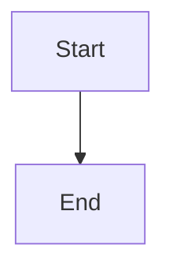

# Mermaid Diagrams

First diagram with backticks:

```mermaid
graph TD
    A[Start]
    B[End]
    A --> B
```

Second diagram with tildes:

~~~mermaid
graph LR
    X[X]
    Y[Y]
    X --> Y
~~~

Normal paragraph with text.
