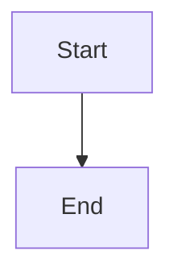

# Source Blocks

Paragraph before the HTML block.

  
Raw <strong>HTML</strong> content.

Paragraph between HTML and math.

$$
E = mc^2
$$

Paragraph between math and the footnote.

Here is a claim with a footnote[^1].

[^1]: The footnote's own definition text.

Paragraph between the footnote and the link reference.

See the [reference link][ref] for details.

[ref]: https://example.com/reference "Reference title"

Paragraph between the link reference and Mermaid.

Paragraph after Mermaid.
